# EDA pass 1 — what the card pool is made of

Everything below is reproducible with `python scripts/run_eda.py`; figures land in
`figures/`. Numbers are from the EN card list (1,267 unique cards).

## The data, and three things that will bite you

The competition ships 8 files that are really 4 — each exists twice under a
spaced and an underscored name (`EN Card Data.csv` and `EN_Card_Data.csv` are
byte-identical). The two PDFs (305 MB combined) are card-image catalogs; the
CSVs are the machine-readable pool.

The CSV is **one row per effect**, not per card: 2,022 rows collapse to 1,267
cards, with the card's own attributes repeated across its attack/ability rows.
`ptcg/data.py` normalizes this into `cards` (1,267) and `effects` (1,811).

Three encoding traps, all handled in the loader:

1. **`n/a` retreat means free retreat, not missing.** 35 Pokémon carry it, and
   they are exactly the cards you would expect — Shaymin, Emolga, Tynamo,
   Jolteon ex, Tapu Koko ex. Reading it as null silently deletes the entire
   free-retreat tier, which is a real mobility archetype.
2. **Trainer rules text has no Move Name.** Keying effects on `Move Name` drops
   191 of 197 Trainer rows. Their text lives in `Effect Explanation` alone.
3. **`Pokémon Tool` matches the substring "Pokémon"** but is a Trainer subtype.
   A naive `str.contains("Pokémon")` misfiles 27 cards as Pokémon.

The file is UTF-8; the `Pokémon` mojibake you may see is cp1252 decoding, not
corruption. A Japanese mirror (`JP_Card_Data.csv`) exists with identical schema.

## 1. The pool is overwhelmingly Basic Pokémon

| Stage / type | Cards |
|---|---|
| Basic Pokémon | 595 |
| Stage 1 Pokémon | 345 |
| Stage 2 Pokémon | 116 |
| Item | 77 |
| Supporter | 61 |
| Pokémon Tool | 27 |
| Stadium | 26 |
| Special / Basic Energy | 20 |

1,056 Pokémon, 191 Trainers, 20 Energy. **Stage 2 lines are only 116 cards** —
any Stage 2 strategy is drawing from a thin, well-defined slice, and pays two
turns of setup for it. 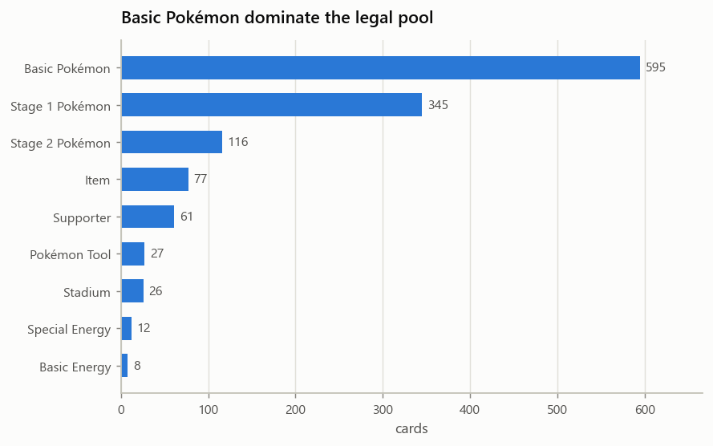

## 2. A second prize buys +180 HP

180 cards (14.2%) have a Rule Box (`Pokémon ex`, `Mega Pokémon ex`, `ACE SPEC`).

| | Count | Median HP | Max HP |
|---|---|---|---|
| Rule box (2+ prizes) | 151 | **270** | 380 |
| Single prize | 905 | **90** | 240 |

The exchange rate is the core deckbuilding decision: a rule-box attacker triples
your HP but halves the number of knockouts the opponent needs. A single-prize
deck needs six knockouts against it to lose; an all-ex deck needs three.
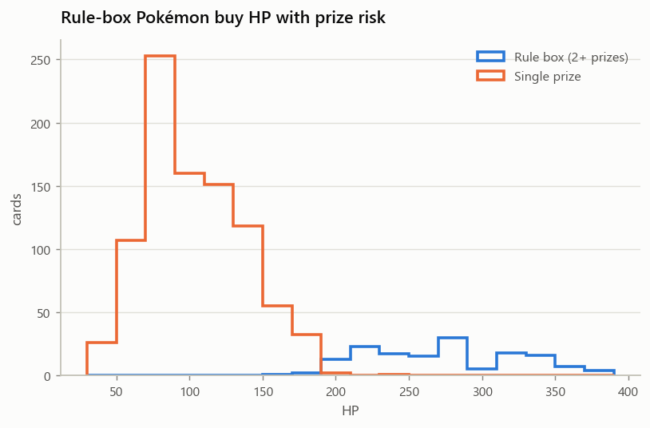

## 3. Efficiency rises with energy cost — setup time is the real currency

| Energy cost | Attacks | Median damage | Median damage/energy |
|---|---|---|---|
| 1 | 458 | 20 | 20.0 |
| 2 | 421 | 50 | 25.0 |
| 3 | 334 | 100 | 33.3 |
| 4 | 61 | 150 | 37.5 |
| 5 | 6 | 235 | 47.0 |

Damage per energy more than doubles from 1 to 5 energy, so the pool *rewards*
investment — but with one energy attachment per turn, a 3-energy attack is a
turn-3 play at the earliest. The tension the agent has to resolve is not "which
attack hits hardest" but "which attack hits hardest **by the turn it matters**."
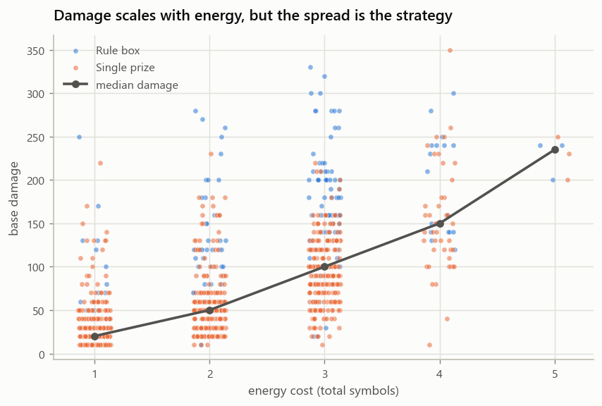

## 4. Damage per energy is a trap metric — 80% of the leaders have a drawback

This is the most actionable finding of the pass. Across all flat-damage attacks,
**15.6%** carry a drawback. Among the **top 40 by damage per energy, 32 (80%)**
do — a 5× enrichment.

The printed energy cost is not the real cost. Palafin ex's Giga Impact is 250
damage for one energy and cannot attack the following turn. Ceruledge's Infernal
Slash is 220 for one, and discards four Fire Energy from hand. Slaking ex swings
for 280 and discards its own energy.

| Hidden cost | Flat attacks |
|---|---|
| Self-damage | 52 |
| Self-discard energy | 49 |
| Cannot attack next turn | 45 |
| Conditional / does nothing | 22 |
| Requires hand resource | 4 |
| Coin flip | 4 |
| Self-status condition | 3 |
| Self-mill | 2 |
| Self-KO / discard | 1 |

Ranking attackers on raw damage/energy puts glass cannons on top. After removing
attacks with drawbacks, the honest leaders are Greninja ex (Shinobi Blade, 170
for one energy, and it *searches your deck*), Flygon ex, and Mega Lucario ex's
Aura Jab. 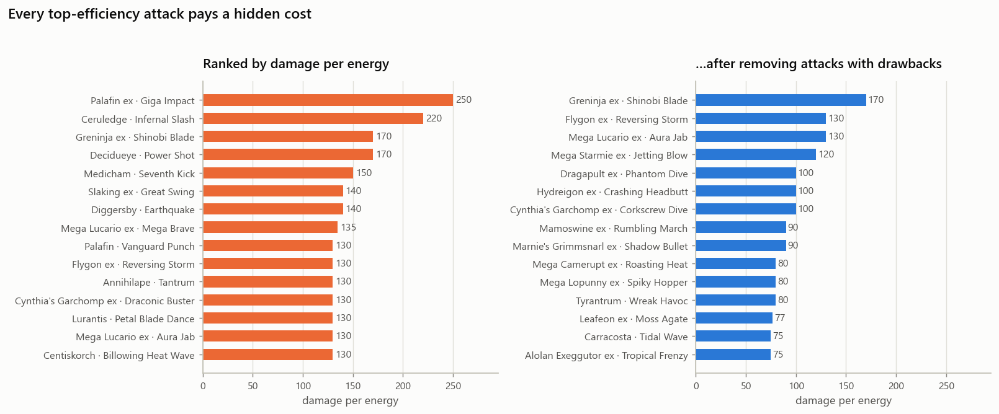

**Implication for the agent:** the state evaluator needs an *effective* cost that
prices the drawback — a lost turn is worth roughly one full attack of tempo, a
discarded hand card is worth its draw-equivalent. `effects.drawback` and
`effects.is_conditional` in the loader are the hooks for that.

## 5. Weakness is near-deterministic, and Fire is the best-rewarded attacking type

The weakness graph is almost a function of type, not a scatter: Grass→Fire,
Fire→Water, Water→Lightning, Lightning→Fighting, Metal→Fire, Fighting→Grass,
Psychic→Darkness. This makes type exposure *predictable* rather than a gamble.

| Attacking type | Pokémon weak to it | Attackers available | Exposure share |
|---|---|---|---|
| **Fire** | **220** | 103 | 21.5% |
| Fighting | 188 | 121 | 18.4% |
| Lightning | 155 | 76 | 15.2% |
| Grass | 141 | 157 | 13.8% |
| Water | 99 | 137 | 9.7% |
| Darkness | 91 | 116 | 8.9% |
| Metal | 86 | 69 | 8.4% |
| Psychic | 41 | 138 | 4.0% |
| Colorless | 0 | 104 | 0.0% |

Fire is the standout: the fewest-but-not-scarce attackers (103) hitting the most
targets (220). Psychic is the inverse trap — 138 attackers competing for 41
weak targets. **Nothing is weak to Colorless**, so Colorless attackers are pure
flexibility with zero weakness upside.
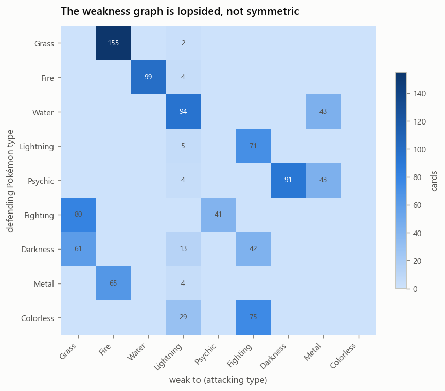 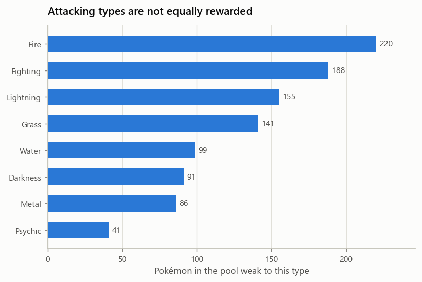

## 6. Trainers buy consistency, not damage

Keyword classification over 197 Trainer effect rows (approximate — regex, not
parsed rules):

| Effect | Cards |
|---|---|
| Search deck | 39 |
| Draw cards | 24 |
| Heal / remove damage | 13 |
| Switch / gust | 13 |
| Energy acceleration | 8 |
| Recover from discard | 6 |
| Opponent disruption | 4 |

Search and draw are a third of the Trainer pool. Disruption is nearly absent (4
cards), which suggests the metagame is a **race, not a control matchup** — you
win by executing your own plan faster, not by breaking the opponent's.
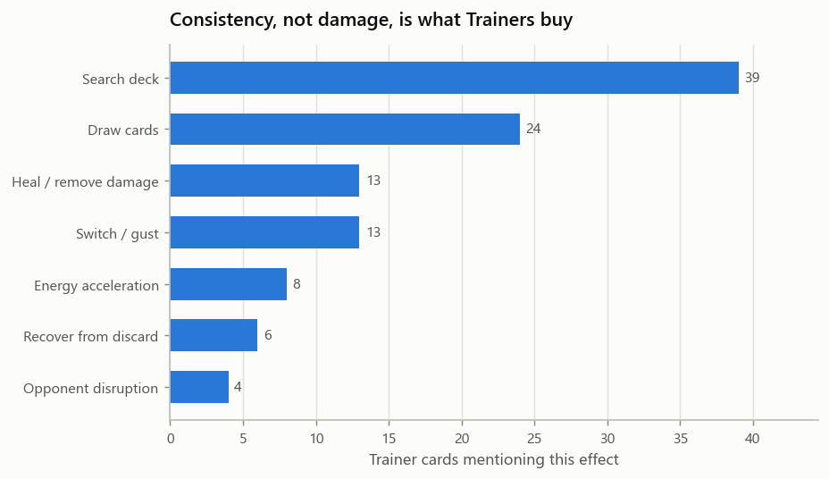

## 7. Mobility is cheap

Retreat cost 0: 35 cards · 1: 531 · 2: 308 · 3: 146 · 4: 36. Over half the pool
retreats for a single energy, so pivoting is usually affordable — which raises
the value of the 13 switch/gust Trainers as *forced* repositioning of the
opponent, not your own.
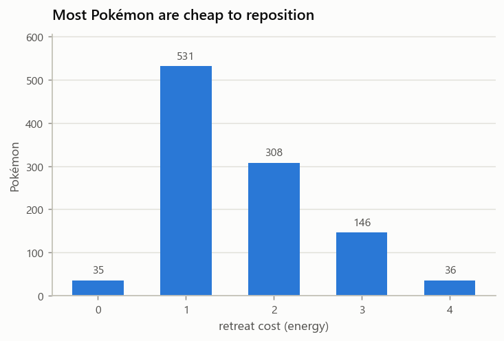

## Where this points next

1. **Build the effective-cost model.** Price each drawback in tempo so attacker
   evaluation stops rewarding glass cannons.
2. **Decide the prize-trade axis first.** Single-prize vs rule-box is the highest
   branch in deck design and everything else follows from it.
3. **Fire or Fighting as the attacking type**, unless the deck concept needs
   Colorless flexibility. Psychic is supply-rich and reward-poor.
4. **Assume a race.** With four disruption cards in the pool, consistency
   (search/draw density) will beat interaction.

---

# EDA pass 2 — the live metagame, from replays

Kaggle publishes the Simulation-category episodes as **public datasets**, one per
day, indexed at `kaggle/pokemon-tcg-ai-battle-episodes-index` (51 days,
2026-06-16 to 2026-08-05, ~21 GB each). These are readable without competition
access, and each replay contains **both players' full 60-card decks and who
won**. That makes the dumps a direct readout of the live metagame.

The join that unlocks this: episode card `id` values are the CSV's `Card ID`.
Verified against max HP — id 164 = Comfey (70), 343 = Shaymin (80), 689 =
Yveltal (110), 743 = Alakazam (140), all exact. `ptcg/episodes.py` parses the
replays; `scripts/mine_meta.py` aggregates them.

Everything below is one day — **2026-07-08: 5,197 matches, 10,394 deck
instances, 172 distinct agents**, median match 146 steps.

## 8. The playable pool is 16% of the printed pool

**197 of 1,267 cards (15.5%) appear in any deck.** The other 1,070 are never
played once across 10,394 decks. Deckbuilding search space is far smaller than
the card list suggests — and the EDA above analyzes a pool that is mostly dead
weight in practice.

## 9. Staples are ubiquitous and therefore worthless as edge

| Card | Play rate | Avg copies | Win rate |
|---|---|---|---|
| Boss's Orders | 83.9% | 2.6 | 49.4% |
| Poké Pad | 83.8% | 4.0 | 49.4% |
| Buddy-Buddy Poffin | 83.5% | 3.9 | 50.0% |
| Night Stretcher | 73.7% | 2.4 | 49.0% |
| Lillie's Determination | 65.3% | 4.0 | 50.6% |
| Xerosic's Machinations | 60.3% | 1.7 | 50.9% |

Every card above 60% play rate sits within one point of an even win rate — by
construction, since a card in most decks is in both winners and losers. **Play
rate and win rate form a funnel**: variance collapses toward 50% as play rate
rises. The edge lives in the sparse left-hand side of the chart.
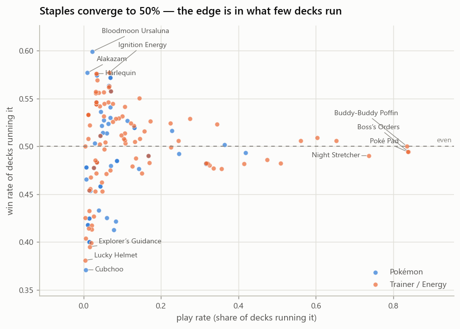 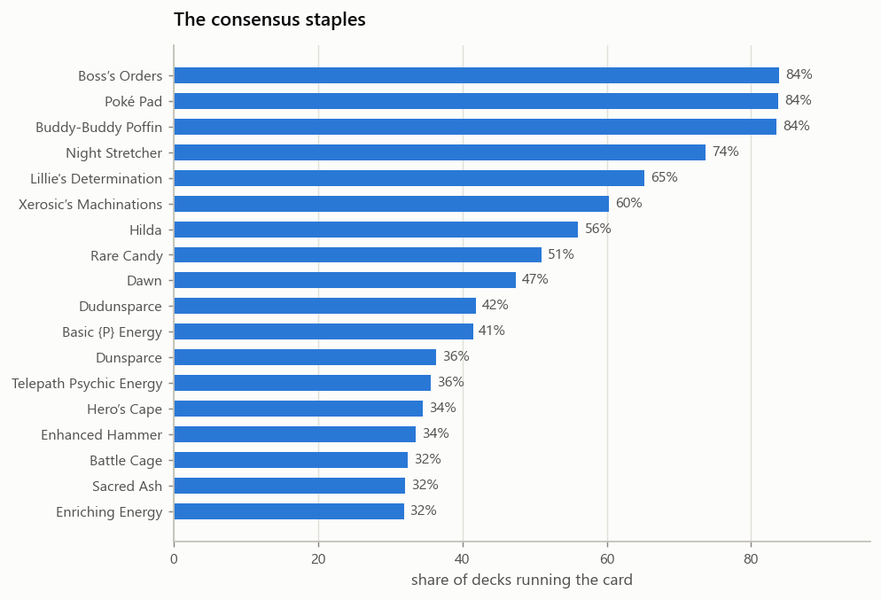

## 10. The most-played archetype is a losing one

| Archetype (biggest attacker) | Decks | Win rate |
|---|---|---|
| **Bloodmoon Ursaluna** | 226 | **60.6%** |
| **Mega Starmie ex** | 712 | **57.2%** |
| **Cynthia's Garchomp ex** | 726 | **55.8%** |
| Mega Kangaskhan ex | 1,169 | 52.7% |
| Cornerstone Mask Ogerpon ex | 555 | 49.9% |
| Marnie's Grimmsnarl ex | 1,733 | 49.0% |
| Fezandipiti ex | 1,390 | 49.4% |
| Dudunsparce | 1,345 | 47.8% |
| Alakazam | 612 | 45.6% |
| Mega Lucario ex | 443 | 45.8% |
| Yveltal | 222 | 43.7% |

The single most common archetype — Marnie's Grimmsnarl ex, 1,733 decks — wins
49.0%. Bloodmoon Ursaluna wins 60.6% off 226 decks, an eighth of the play. The
field has not converged on the best deck, which is the opening a Strategy
submission can argue from. 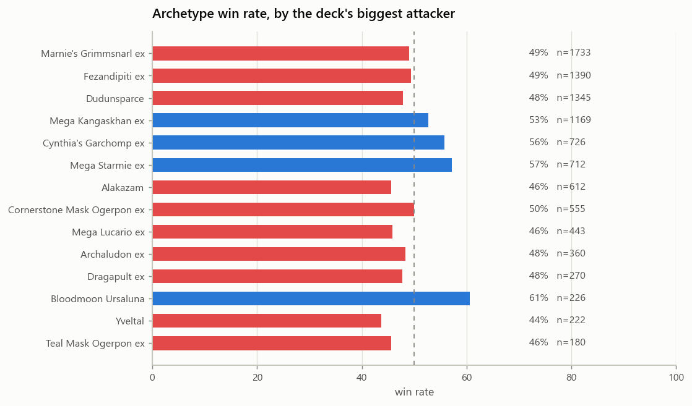

Card-level, the same pattern: **Froslass is played in 7.8% of decks and wins
41.3%** — popular *and* bad. Bloodmoon Ursaluna (2.3% play) and Mega Starmie ex
(6.9%) are the under-adopted winners.

Top agents by win rate (≥100 games): Yushin Ito 61.3% (644), Majkel1337 60.1%
(661), nasuo445 58.4% (596).

## 11. Correction to §6 — this is not a race, and disruption is everywhere

My §6 keyword taxonomy found 4 disruption Trainers and I concluded the metagame
would be "a race, not a control matchup." **The replays say otherwise.**
Xerosic's Machinations is in 60.3% of decks and Enhanced Hammer in 33.6%;
Crushing Hammer shows up in the very first deck I decoded. Energy denial is a
core meta pillar.

The regex undercounted because it only looked for hand/deck disruption —
Enhanced Hammer's "Discard a Special Energy from 1 of your opponent's Pokémon"
matches none of my patterns. **The lesson is methodological: a keyword taxonomy
over card text is a weak proxy for what a card does, and the replays are the
ground truth.** Prefer measured play rates over inferred card roles.

Similarly, §1's "Stage 2 lines are a thin slice" understates them: Rare Candy is
in 50.9% of decks and the Abra/Kadabra/Alakazam line in 31.6%. Thin in the card
list, common at the table.

## Where pass 2 points

1. **Target the Ursaluna / Starmie / Garchomp cluster**, not the popular
   Grimmsnarl and Fezandipiti decks. The field is misallocated.
2. **Staples are non-negotiable** — Boss's Orders, Poké Pad, Buddy-Buddy Poffin,
   Night Stretcher are ~4-of in most decks. Spend design effort elsewhere.
3. **Mine more days.** One day is a snapshot; the index covers 51. A win-rate
   trend per archetype would show what is rising, and whether Ursaluna's edge
   survives contact with a field that adapts.
4. **Match-length and turn-order effects** are unexplored and sitting in the
   replays.

---

# EDA pass 3 — multi-day meta, and the finding that changes the plan

Five days mined (2026-08-01 … 08-05, plus 07-08), one at a time: download,
aggregate into `data/history_*.csv`, delete the 20 GB dump, next day.

## 12. The meta moves, and the popular deck stays bad

| Archetype | 07-08 | 08-03 | 08-04 | 08-05 |
|---|---|---|---|---|
| Marnie's Grimmsnarl ex (most played, every day) | 49.0% | 45.9% | 46.3% | 45.4% |
| Mega Lopunny ex | 47.8% *(n=69)* | 57.0% | 53.9% | 56.1% |
| Fezandipiti ex | 49.4% | 49.3% | 50.1% | 50.6% |

Mega Lopunny ex went from a 69-deck curiosity to ~1,200 decks a day at ~56%.
Marnie's Grimmsnarl ex is the most-played deck *every single day* and has never
once had a winning record. The field's misallocation from §10 is not a one-day
artifact — it is stable across a month.

Best agents shift daily (Yushin Ito 61.3% on 07-08, Luca 65.3% on 08-05,
Majkel1337 63–66% on 08-03/08-04), but Majkel1337 places in the top five on
most days.

## 13. The meta is only ~120 decklists wide

On 2026-08-04, 9,614 deck instances resolve to **112 distinct 60-card lists**;
on 08-03, 9,434 instances to 120. Agents are copying each other. That means
decklist-level analysis is tractable in a way archetype-level analysis is not:

The best individual list is a **Mega Lucario ex build at 69.5% over 239 games**
(Wilson lower bound 63.3%), run by just 2 agents. The *archetype* average for
Mega Lucario ex is 45.8%. **The list matters far more than the archetype** — a
23-point spread inside one archetype name.

## 14. Deck strength is not separable from the policy that plays it

This is the finding that redirected the build.

I adopted that 69.5% Mega Lucario list and measured it. Piloted by our heuristic
agent, against the trivial 9-card sample deck **also piloted by our heuristic**,
it lost **32–88 (26.7%)**. Against a random agent on a mirror deck it managed
exactly 50%, versus 89% for the sample deck.

A top player's list encodes their agent's competence: evolution lines timed
correctly, Energy placed deliberately, Supporters sequenced. Hand that list to a
greedy agent and it is *worse than a deck with no decisions in it*, because
every card it misplays is a card the simple deck never asked it to play.

**So a deck must be chosen for the pilot, not for the leaderboard.**
`scripts/design_deck.py` builds for pilotability instead: Basic Pokémon only (no
evolution to misplay), one Energy type (every attachment is live), and only
unconditional attacks (so "attack with the biggest number" is correct). The
strongest mono-type pool by this filter is **Fighting** — which is also the #2
best-rewarded attacking type from §5's weakness analysis, at 188 targets.

## Open blocker

Competition data for the Simulation category is still **403**. The correct slug
is `pokemon-tcg-ai-battle` (not `-simulation`) — the API confirms the
competition exists at that URL but reports rules not accepted. Accepting the
rules at <https://www.kaggle.com/competitions/pokemon-tcg-ai-battle> is what
unblocks the battle engine and the ability to submit an agent. The public
episode datasets above need no such access, so metagame analysis can continue
regardless.
